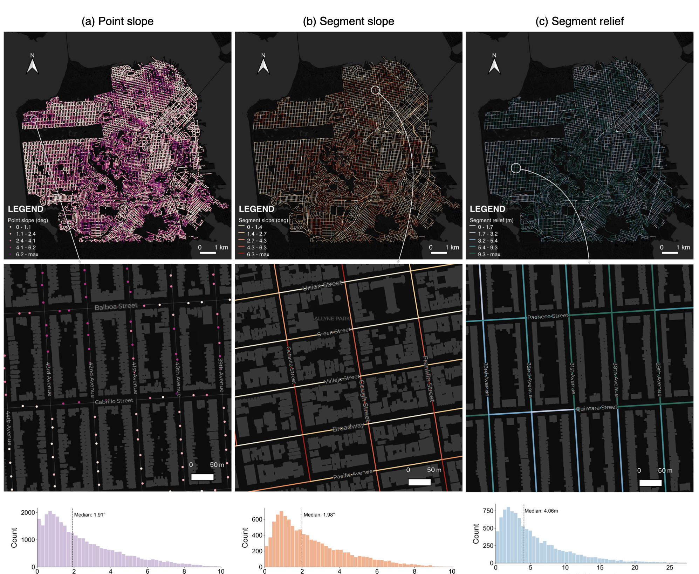

<!--  -->

    

# Vision2Slope

**Primary Author:** [Yang CHEN](https://cubicsyang.github.io/) (Nanjing Normal University)

An integrated pipeline for two-level road slope analysis from single panoramic street view images

## Overview

**Vision2Slope** is a comprehensive pipeline designed to analyze road slopes using single panoramic street view images. The pipeline leverages advanced computer vision techniques to extract and compute slope information along the road, including both **point-level and segment-level** analyses, which can be useful for various applications such as urban planning, navigation, and infrastructure development.

## Key Features

- **Panorama Support**: Automatically converts panoramic street view images to perspective views (left and right) for accurate slope analysis.

- **Side-view Deskewing**: Transforms panoramic images into side-view perspectives and corrects vertical distortions to ensure accurate analysis using semantic and geometric prompts.

- **Point-level Slope Estimation**: Computes the slope of the road surface at specific points using the segmented road areas and their 3D geometry.

- **Segment-level Slope Estimation**: Analyzes the slope over larger road segments to provide a comprehensive understanding of road gradients and relief.

## Results

The pipeline generates detailed slope analysis results, including visualizations of slope distributions and numerical slope values for both point-level and segment-level analyses.

*Figure: Two-level road slope maps using Vision2Slope.*

## TODO list

- [x] Release the codebase
- [x] Add installation instructions
- [x] Provide usage examples
- [ ] Support panoramic image input
- [ ] Integrate more SVI platforms into Vision2Slope
- [ ] Expand study to diverse geographic locations

## Acknowledgements

This project is inspired and supported by the Google Street View, OpenStreetMap, and Opentopography communities for providing open access to their valuable data resources.
